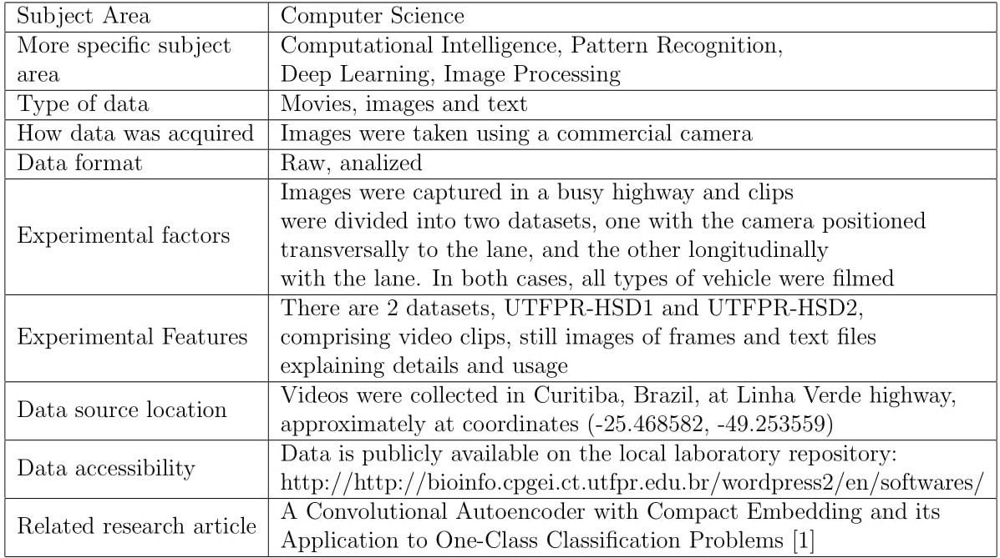
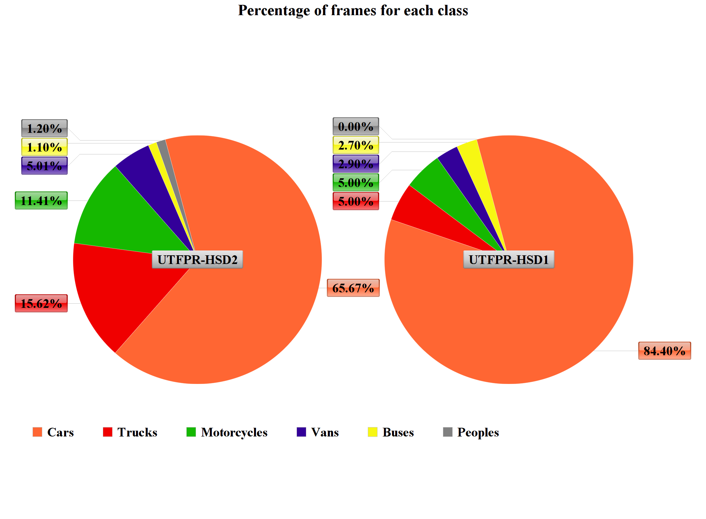
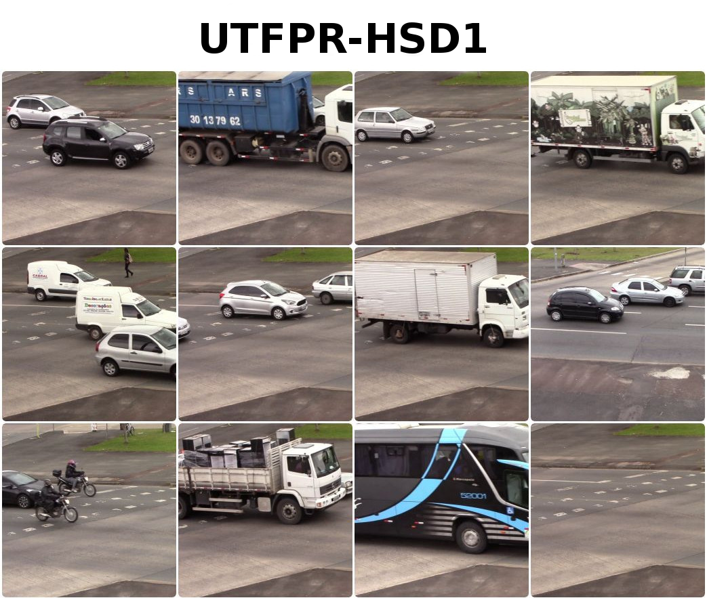
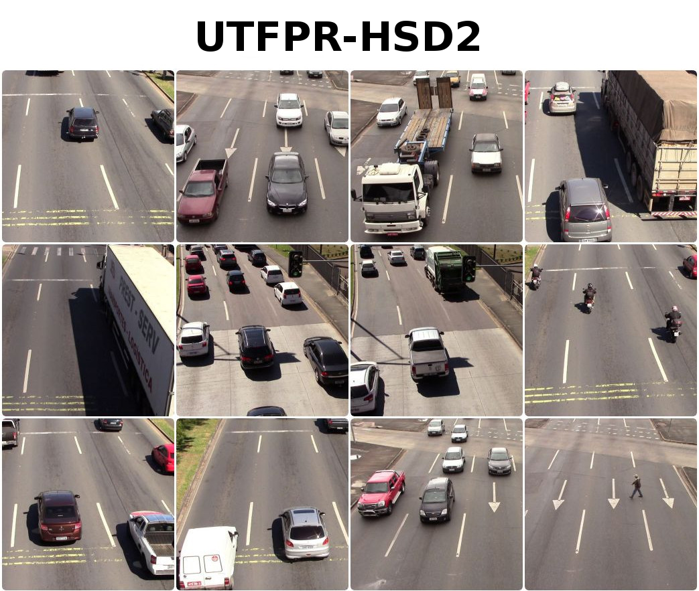

# UTFPR-HSD - Federal University of Technology - Paraná - Highway Surveillance Dataset

## Fully-labeled video dataset to anomaly detection

This dataset was created specifically for anomaly detection in videos. We provide annotated video clips and still frames taken in a busy highway. Anomaly in this context, can be described as any of the present classes that are: **cars, trucks, buses, motorcycles, people and vans**. There are two datasets, **UTFPR-HSD1** and **UTFPR-HSD2**, with videos taken at different positions, transversally and longitudinally to the lane. Videos were collected at 25 fps (frames per second) with resolution 1920 x 1080 pixels. There are 61 video clips in total, comprising, 15664 frames.

## Specifications Table

## Value of the data

* There are very few video datasets especially devised for anomaly detection. These two datasets includes images taken in a highway where trucks are not allowed at certain hours of the day. Such events are considered anomalies. However, as all classes are fully-labeled, for academic purposes, any of the classes can be treated as anomaly.

* Data is provided mainly for training One-Class classifiers for anomaly detection, in video frames. But, due to the labeling this data can also be used for counting vehicles. This dataset includes videos and still images (frames) so that data can be analyzed  in different ways.

* Differently from other video/image datasets, we put available both the clips, the discretized frames, and a text file with the ground truth (indicating anomalies or normal frames)

## Data

Data were collected in a highway in a clear day, the initial objective was to detect large vehicles (trucks), since they are not allowed to run during certain hours of the day. Videos were collected with the camera in two positions, such that the highway lane was filmed transversally (UTFPR-HSD1) and longitudinally (UTFPR-HSD2). For the first case, the camera was positioned at the floor level. For the latter, the camera was positioned above the floor level in an elevated level. UTFPR-HSD2 has three different scenarios: (i) vehicles coming towards the camera, (ii) vehicles leaving away the camera with and without obstacles to the camera.

Videos were collected at 25 fps (frames per second) with resolution 1920 x 1080 pixels. All frames extracted from videos have the same resolution. The figure below summarizes the quantity of each class in the dataset.

## Sample images from UTFPR-HSD1 and UTFPR-HSD2

## Links to the data

### UTFPR-HSD1 - Transversally to the lane
[UTFPR-HSD1](https://drive.google.com/file/d/1C3mXMpItQgctGALu7cGMAmeOShXdzIOY/view?usp=sharing)

### UTFPR-HSD2 - Longitudinally to the lane
[UTFPR-HSD2](https://drive.google.com/file/d/1-V-NM1uqWSbFNRHp2pZkKsNKvsW1D4Ty/view?usp=sharing)

## Acknowledgments

M. Ribeiro thanks the Catarinense Federal Institute and IFC/CAPES/Prodoutoral for the scholarship; M. Gutoski thanks CAPES for the scholarship; H.S.Lopes thanks CNPq for the research grant number 440977/2015-0. All authors thank NVIDIA for the donation of the GPUs used in this work.

## Publications:

**[1]** M. Ribeiro, A. E. Lazzaretti, H. S. Lopes, A convolutional autoencoder
with compact embedding and its application to one-class classification
problems, Neurocomputing ?? (??) ??–??

